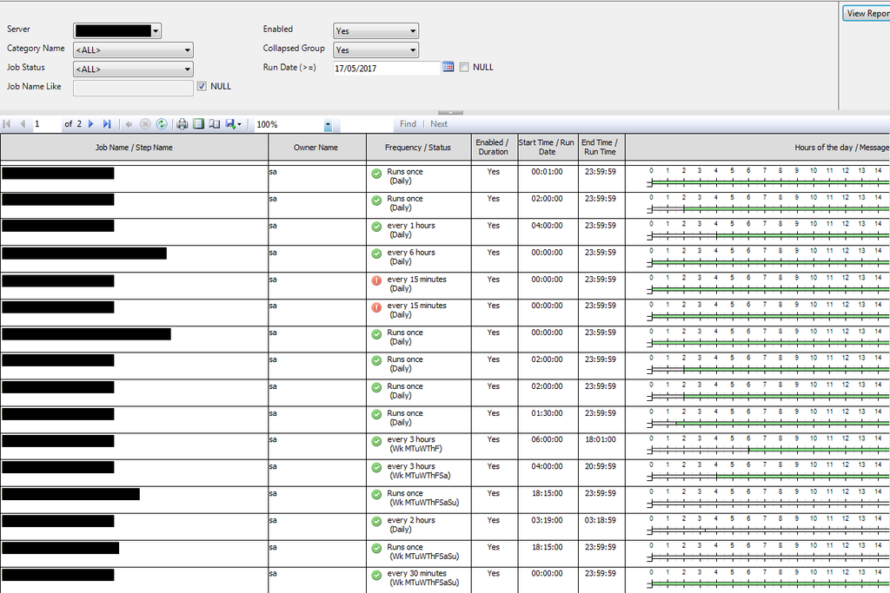
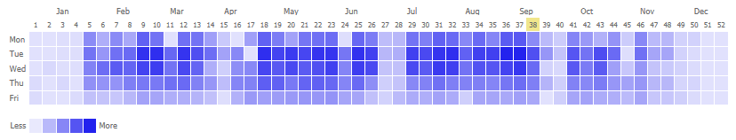
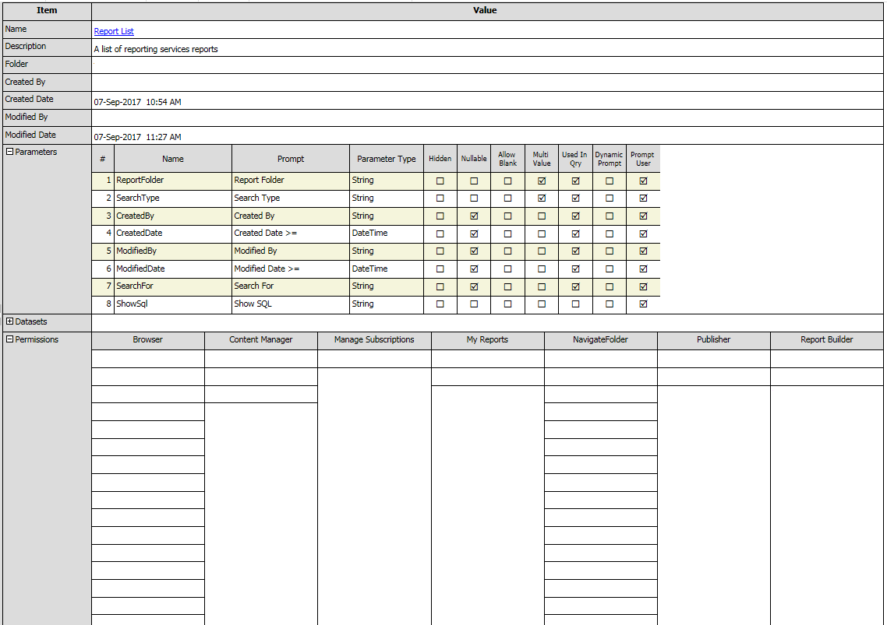
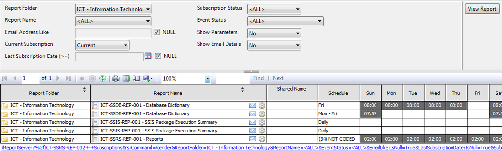

# Microsoft SQL Server Reporting Services (SSRS)
The following examples are used to query the database & report server. I have included some useful scripts and documents as well.

## File List
### [Miscellaneous](/Miscellaneous)                        
#### [Documentation](/Miscellaneous/Documentation)
* [Report Requirements](/Miscellaneous/Documentation/Report%20Requirements.docx)
* [Report Style Guide](/Miscellaneous/Documentation/Report%20Style%20Guide.docx)
* [Report Unit Testing Checklist](/Miscellaneous/Documentation/Report%20Unit%20Testing%20Checklist.docx)
#### [Scripts](/Miscellaneous/Scripts)
* [CandyStripe](/Miscellaneous/Scripts/CandyStripe.vb)
* [HeatMapColor](/Miscellaneous/Scripts/HeatMapColor.vb)
* [HeatMapColorGradate](/Miscellaneous/Scripts/HeatMapColorGradate.vb)
* [UpdateSubscriptionOwner](/Miscellaneous/Scripts/UpdateSubscriptionOwner.sql)
### Reports                       
#### Database Server      
* [Activity Moniter](/ServerDatabase/Activity%20Moniter.rdl)
* [Database Dictionary](/ServerDatabase/Database%20Dictionary.rdl) <kbd></kbd>
* [Job Search](/ServerDatabase/Job%20Search.rdl)
* [Scheduled Jobs](/ServerDatabase/Scheduled%20Jobs.rdl)  <kbd></kbd>
#### Report Server           
* [Data Sources](/ServerReports/Data%20Sources.rdl)
* [Execution Log](/ServerReports/Execution%20Log.rdl)
* [Heat Map Calendar](/ServerReports/Heatmap%20Calendar.rdl) (using execution log) <kbd></kbd>
* [Permissions](/ServerReports/Permissions.rdl)
* [Report Documentation](/ServerReports/Report%20Documentation.rdl)  <kbd></kbd>
* [Report List](/ServerReports/Report%20List.rdl)  <kbd></kbd>
* [Subscriptions](/ServerReports/Subscriptions.rdl)  <kbd></kbd>
