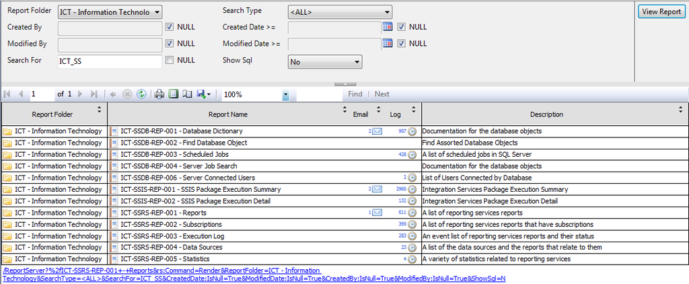

# SQL Server Reporting Services
Various example reports I use for Reporting Services

## Example Reports
* [Activity Moniter](Activity%20Moniter.rdl)
* [Data Sources](Data%20Sources.rdl)
* [Database Dictionary](Database%20Dictionary.rdl)
<h1 align="left">
  
</h1>

* [Execution Log](Execution%20Log.rdl)
* [Report List](Report%20List.rdl)
<h1 align="left">
  
</h1>

* [Scheduled Jobs](Scheduled%20Jobs.rdl)
* [Subscriptions](Subscriptions.rdl)
