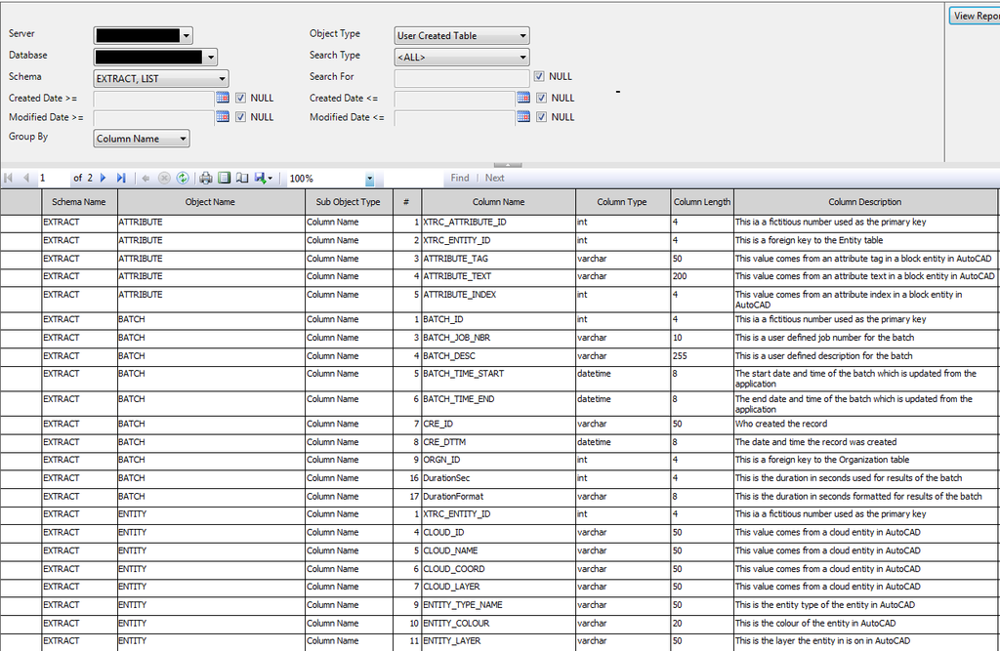

# SQL Server Reporting Services
Various example reports I use for Reporting Services

## Example Reports
* [Activity Moniter](/ExampleReports/Activity Moniter.rdl)
* [Data Sources](\ExampleReports\Data Sources.rdl)
* [Database Dictionary](\ExampleReports\Database Dictionary.rdl)
<h1 align="left">
  
</h1>
* [Execution Log](\ExampleReports\Execution Log.rdl)
* [Report List](\ExampleReports\Report List.rdl)
* [Scheduled Jobs](\ExampleReports\Scheduled Jobs.rdl)
* [Subscriptions](\ExampleReports\Subscriptions.rdl)
